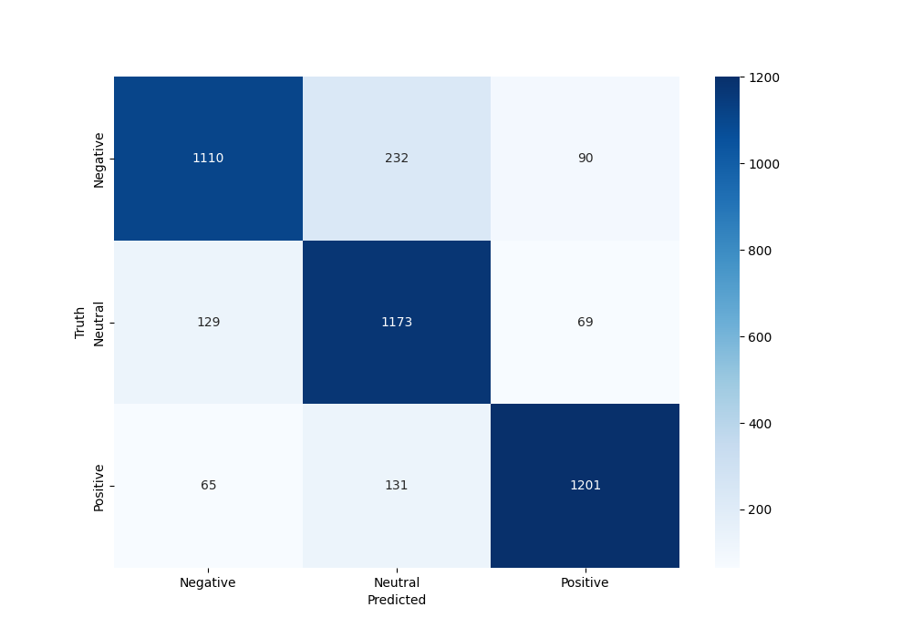

# 中文文本情感分析(final project)

该文档记录了本人在中文信息处理课程上的期末项目


### Model

模型中涉及到的BERT利用的是HFL预训练的中文预训练BERT模型，通过`from_pretrained` 方法并添加路径`'hfl/chinese-bert-wwm-ext'`即可加载预训练模型。项目使用该预训练模型在我们的情感分类数据集上进行微调，并在BERT学习到表征向量后，利用全连接线形层做简单分类。项目采用三个数据源的数据集并整合成三个文件用于分别训练只分类积极与消极情感的二分类模型，分类积极、中性和消极的三分类模型，以及分类null, like, sadness, disgust, anger, happiness六种情感的六分类模型。在课程第一次作业中我就已经利用BERT实现了不错的分类效果，但没有考虑其他诸如LSTM、BiLSTM、Transformer这一类能够学习长序列关系的深度模型，只与传统的机器学习方法如SVM，GaussianNB等进行比较。且由于BERT自带的`BertTokenizer`利用WordPiece规则进行分词，使得事实上我们输入BERT Embedding层的输入是单字分词的。该项目完善了当时的不足，提升了最优模型的性能，并探讨了按中文语意分词处理输入后，对深度模型的效果影响。训练过程中我们保存了一系列模型参数，使得可以在后续网页演示时直接加载进行预测。`model_with_x.pth`保存的是数据集先经过jieba词性标注分词后x分类BERT的模型参数，`LSTM_with_x.h5`保存的是先经过jieba词性标注分词后x分类LSTM的模型参数，`BiLSTM_with_x.h5`保存的是先经过jieba词性标注分词后x分类BiLSTM的模型参数，同样的也有`without`参数的模型，它们对应没有经过jieba词性标注分词后的模型参数。当然，你可以利用该项目在自己的数据集上训练自己的模型，只需要替换读取输入的路径以及保存的路径。


### Dataset

你可以通过下面的网址下载该项目所用的数据集

  - (Weibo)https://www.biendata.xyz/ccf_tcci2018/datasets/emotion/ 
  - (Sina)https://www.biendata.xyz/ccf_tcci2018/datasets/tcci_tag/19 
  - (ChnSentiCorp_htl_all)https://github.com/SophonPlus/ChineseNlpCorpus 

项目所用的三个数据文件的描述如下：

- `ChnSentiCorp_htl_all.csv` 从 https://github.com/SophonPlus/ChineseNlpCorpus 得到，除了删除了一个nan值，没有做其他任何操作。(二分类，训练所用数据为4800条)

- `Positive_null_negative.csv` 得到方式为，对于Sina数据集，将 **like**, **happy** 数据归入 **positive** 以及将 **sad**,**disgust**,**angry** 归入 **negative** 然后再合并 Weibo数据集, 最后再将酒店的二分类数据集并入，得到最大的三分类数据文件。(三分类，训练所用数据为42000条)
- `Sina.csv` 项目将Sina数据集和部分其他Weibo六种情感数据集进行合并得到。(六分类，训练所用数据为36000条)


### Training

运行 `python BertSentiment.py` 即可训练，记得调整分类数目`num_labels`参数以及从输入文件中分出各个情感的子Dataframe，再利用`Process.py`文件中的`get_balance_corpus_6`方法构建平衡语料数据(本质是避免分类任务的类别不均衡)


$$
fig1.Best\,Model\;二分类\;Training\;Process
$$


### Experiment

我们对BERT模型进行了参数调整以及增加Early-stop策略，并引入一系列的评估标准和测试指标来展示我们的结果，与第一次作业相比有大幅提升，并训练了单向LSTM和双向LSTM两个适用于NLP的深度学习模型，所有模型都考虑了是否经过jieba的词性标注分词，以探讨分词的影响。


$$
fig2.BERT\;Parameters\; In \; Training
$$

$$
fig3.LSTM\;and \;BiLSTM\;Hyperparameters
$$


### Evaluation

对于分类问题，我们采用准确率，F1_score，Negative Log Loss, Cohen Kappa Score

- F1_score是precision和recall的调和平均，F1 分数范围从 0 到 1，其中 1 表示完美的精度和召回率，0 表示精度或召回率（或两者）为零
- Negative Log Loss，是一种用于评估模型性能的指标，主要用于分类问题。 它衡量模型预测的概率分布与实际概率分布之间的差异。NLL值越小，模型的预测性能越好。 当模型对所有样本的预测完全正确时，NLL值为0。而且，NLL更能体现模型对预测的“置信度”
- Cohen Kappa 是一种统计度量，用于评估两个评估者之间的一致性，并衡量多类分类问题中预测类与实际类之间的一致性，CK 的值范围为 -1 到 1。值为 1 表示预测值与实际值之间完全一致。 值为 0 表示一致性并不比偶然性更好。 负值表示一致性比偶然性更差


### Result

#### 数据表格中所有右上角带*号的模型指，输入先经过分词操作后的

```python
import jieba.posseg as seg
def feature_extract(data):
    feature_type = ['a','an','av','v','z','d','c']
    data['review'] = data['review'].astype(str).apply(lambda x: ' '.join([w.word for w in seg.lcut(x,use_paddle=True) if w.flag in feature_type]))
    return data
```


#### 二分类：

|         | test_acc  | f1_score  | NLL       | CK        |
| ------- | --------- | --------- | --------- | --------- |
| BERT*   | 0.900     | 0.900     | 0.259     | 0.800     |
| BERT    | **0.942** | **0.942** | **0.160** | **0.883** |
| LSTM*   | 0.804     | 0.804     | 0.510     | 0.606     |
| LSTM    | 0.575     | 0.469     | 0.677     | 0.079     |
| BiLSTM* | 0.833     | 0.834     | 0.476     | 0.677     |
| BiLSTM  | 0.571     | 0.474     | 0.678     | 0.073     |

$$
Table1.\; Experiment\; results\; on\; ChnSentiCorp\_htl\_all.csv
$$


$$
fig4.Best\,Model\;二分类Confusion\,Matrix
$$

$$
fig5.Best\,Model\;二分类ROC曲线
$$

#### 三分类：

|         | test_acc  | f1_score  | NLL       | CK        |
| ------- | --------- | --------- | --------- | --------- |
| BERT*   | 0.687     | 0.689     | 0.763     | 0.531     |
| BERT    | **0.830** | **0.830** | **0.507** | **0.744** |
| LSTM*   | 0.619     | 0.613     | 0.929     | 0.429     |
| LSTM    | 0.501     | 0.492     | 0.981     | 0.256     |
| BiLSTM* | 0.645     | 0.643     | 0.809     | 0.469     |
| BiLSTM  | 0.527     | 0.519     | 0.930     | 0.294     |

$$
Table2.\; Experiment\; results\; on\; Positive\_null\_negative.csv
$$


$$
fig6.Best\,Model\;三分类Confusion\,Matrix
$$

$$
fig7.Best\,Model\;三分类ROC曲线
$$

#### 六分类：

|         | test_acc  | f1_score  | NLL       | CK        |
| ------- | --------- | --------- | --------- | --------- |
| BERT*   | 0.482     | 0.491     | 1.576     | 0.362     |
| BERT    | **0.504** | **0.506** | **1.340** | **0.405** |
| LSTM*   | 0.397     | 0.398     | 1.690     | 0.278     |
| LSTM    | 0.331     | 0.343     | 1.664     | 0.198     |
| BiLSTM* | 0.456     | 0.455     | 1.628     | 0.348     |
| BiLSTM  | 0.373     | 0.388     | 1.627     | 0.248     |

$$
Table3.\; Experiment\; results\; on\; Sina.csv
$$


$$
fig8.Best\,Model\;六分类Confusion\,Matrix
$$

$$
fig9.Best\,Model\;六分类ROC曲线
$$

### Conclusion

实验表明BERT模型与其他模型相比仍然是取得了最优效果，且具有较为明显的差距，而BiLSTM在有无分词的情况下都效果好于LSTM是符合我们对于模型理解的预期的。双向的LSTM从模型理解上是能够更好的捕捉上下文的信息来学习句子的表征的。而LSTM、BiLSTM以及第一次作业中其他机器学习模型在对比实验中表明，经过词性标注分词之后的输入将会帮助模型去学习句子间的情感信息。但同时，实验也表明了表现最好的BERT模型，在不经过词性标注分词的情况下取得更好的情感分析效果。对此的理解是，一方面数据集存在一定规模的“脏”数据，对于项目中所提取的诸如形容词、副词、动词等词性的分词序列往往与真实表达有一点差距，这对于学习能力极强、捕捉上下文能力极强的BERT而言，会使得他漏掉字里行间的其他情感含义，换言之，我们不需要对句子进行人为的词性标注与分词操作，BERT模型可以很好的提取以字为单位的句子语意间的关联。另一个实验发现是我们糅合成的较大规模多分类数据集，往往有较多“脏”数据，所有模型在三个数据集上的表现是递减的。


### Display

该项目实现了一个简单的本地网页演示，当然你可以基于此将你所训练的模型预加载到该网页上，并进行预测显示。

想要运行该网页，你只需要运行项目文件夹下的`python app.py`, 然后打开 `情感分析.html` file.

你可以选择`二分类`,`三分类`还是`六分类`，然后在文本框内输入自己想要预测的句子，点击提交，下方label即会显示出情感分析结果。


### In the end

关注到六分类时最优模型的准确率仅有**50%**左右，未来的工作可以是尝试提升多分类任务情况可用于中文文本情感分析的深度学习模型、机器学习模型的性能。
